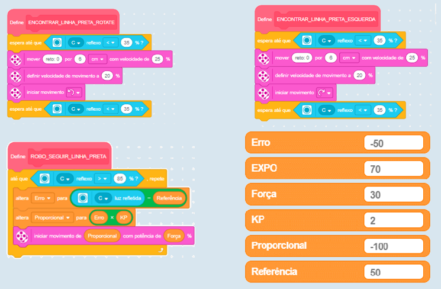
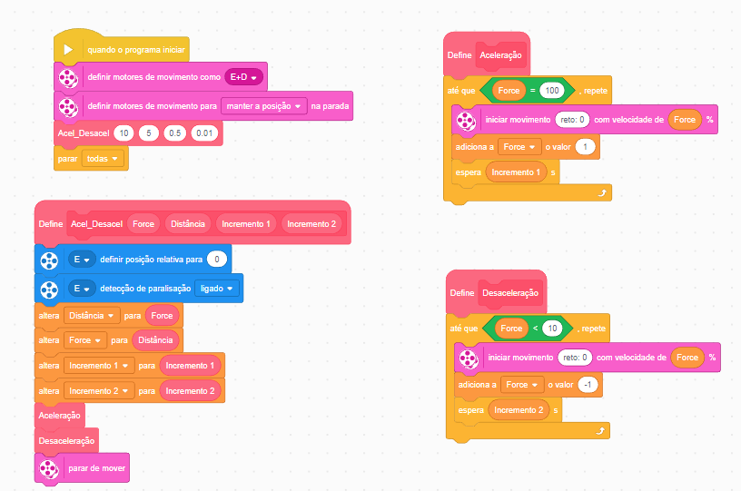
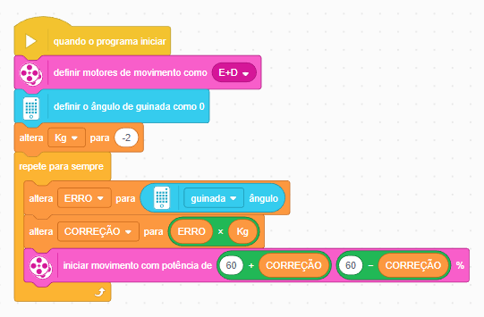

# Spike-Cyber-s
<h1 align="center"> Robô Cyber-S </h1>

 

## :bookmark_tabs: Sobre o projeto

O desafio proposto pela organização do Torneio Brasil de Robótica foi a respeito da Fitossanidade, que é o estudo de diversas plantas, pragas e doenças. E suas técnicas consistem em estudar, controlar e minimizar os danos causados. Levando isso em conta, as missões falam a respeito de plantar itens certos nos lugares certos, e remover itens indevidos e descartá-los.

> _Projeto baseado na metodologia ágil SCRUM, procurando desenvolver a Proatividade, Autonomia, Colaboração e Entrega de Resultados dos envolvidos_
:pushpin: Status do Projeto: **Concluído** :heavy_check_mark:

## :desktop_computer: Programações 

A partir das missões propostas, foi possível gerar uma análise, traçar as melhores rotas e a partir daí começar a programação. Varias foram geradas até que se chegasse na definitiva. Foram usadas algumas técnicas para deixar o robô mais inteligente. O robô conta com diversos momentos de alinhamento no tapete, para garantir posição, leitura de cores do tapete e dos itens de missões. Tudo isso para que o robô se tornasse totalmente autônomo, uma vez solto no tapete, ele termina todas as missões por conta própria.

:dart: Seguidor de Linha PID 

. Proporcional: O quão ruim esta a situação agora?  
. Integral: As minhas correções anteriores ajudaram a melhorar as coisas? 
. Derivada: Como a situação esta mudando?  
. Controle PID: Combina os valores do erro, integral e derivada para decidir a direção do robô

 

> _Programação baseada na leitura do reflexo das cores no tapete, ao serem submetidas a certa intensidade de luz do próprio sensor._ 
:pushpin: Status do Projeto: **Concluído** :heavy_check_mark:

:dart: Acelerador

Essa programação consiste em movimentar o robô em sua velocidade máxima mas sem perder precisão, então para isso ele acelera de forma exponencial e também desacelera do mesmo modo, sempre de forma gradativa, evitando trancos indesejáveis. Para isso foi utilizado variáveis que com o tempo incrementam de valor, e esse valor é entregue como potência para os motores motores.

 

> _Programação baseada no incremento e decremento de valores de variáveis através do tempo._ 
:pushpin: Status do Projeto: **Concluído** :heavy_check_mark:

:dart: Andar Com o Giroscópio

Consiste em entregar direção de movimento para os motores através do sensor giroscópio. Uma posição angular é definida no início da ação, e esse ângulo é usado como base para direcionar o robô, sempre comparando a referência, com o que o sensor está captando.

 

> _Programação baseada no aferimento de velocidade angular através do giroscópio._ 
:pushpin: Status do Projeto: **Concluído** :heavy_check_mark:

## :robot: Estrutura 

Na questão estrutural, também foi projetado diversos protótipos até se alcançar o mais adequado. Tudo é levado em conta, distância dos sensores em relação ao chão, tamanho dos pneus, posição dos cabos. Com tudo isso chegou-se ao modelo ágil, compacto e de fácil reparo.

 

> _Primeiro modelo de robô desenvolvido, apenas um sensor de cor, pneus finos e falta de estética._ 
:pushpin: Status do Projeto: **Concluído** :heavy_check_mark:

Depois de muitas análises o robô definitivo ganhou vida, agora com mais sensores para maior precisão, sistema de sombra para sensores de luz, pneus mais largos para maior força de tração, e uma estética trabalhada.

 

