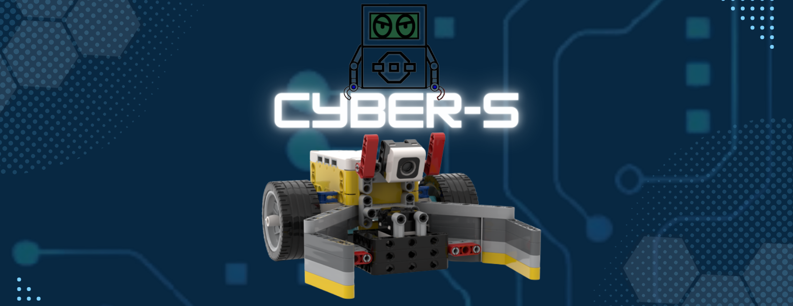

# Spike-Cyber-s
<h1 align="center"> Robô Cyber-S </h1>

 

## :bookmark_tabs: Sobre o projeto

O desafio proposto pela organização do Torneio Brasil de Robótica foi a respeito da Fitossanidade, que é o estudo de diversas plantas, pragas e doenças. E suas técnicas consistem em estudar, controlar e minimizar os danos causados. Levando isso em conta, as missões falam a respeito de plantar itens certos nos lugares certos, e remover itens indevidos e descartá-los.

> _Projeto baseado na metodologia ágil SCRUM, procurando desenvolver a Proatividade, Autonomia, Colaboração e Entrega de Resultados dos envolvidos_
:pushpin: Status do Projeto: **Concluído** :heavy_check_mark:

## :desktop_computer: Programações 

A partir das missões propostas, foi possível gerar uma análise, traçar as melhores rotas e a partir daí começar a programação. Varios foram geradas até que se chegasse na definitiva

